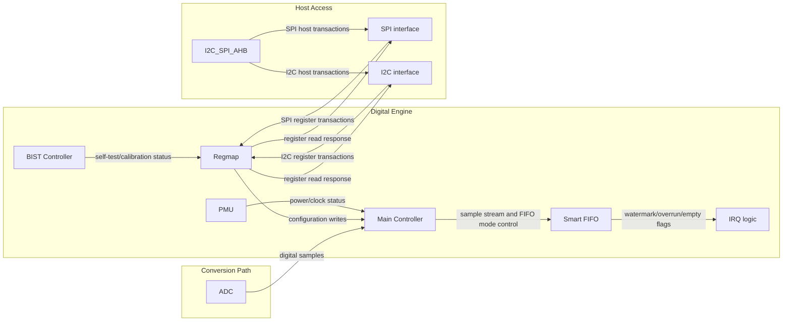

# Micro-Architecture Block Diagram

This diagram uses the current project-specific block names from `block_inventory.csv` and the connections from `interaction_matrix.csv`.

```mermaid
flowchart LR
    subgraph Conversion["Conversion Path"]
        ADC["ADC"]
    end
    subgraph Digital["Digital Engine"]
        MC["Main Controller"]
        FIFO["Smart FIFO"]
        IRQ["IRQ logic"]
        REG["Regmap"]
        PMU["PMU"]
        BIST["BIST Controller"]
    end
    subgraph Host["Host Access"]
        HOST["I2C_SPI_AHB"]
        SPI["SPI interface"]
        I2C["I2C interface"]
    end
    ADC -->|digital samples| MC
    MC -->|sample stream and FIFO mode control| FIFO
    FIFO -->|watermark/overrun/empty flags| IRQ
    REG -->|configuration writes| MC
    SPI -->|SPI register transactions| REG
    I2C -->|I2C register transactions| REG
    REG -->|register read response| SPI
    REG -->|register read response| I2C
    PMU -->|power/clock status| MC
    BIST -->|self-test/calibration status| REG
    HOST -->|SPI host transactions| SPI
    HOST -->|I2C host transactions| I2C
```

