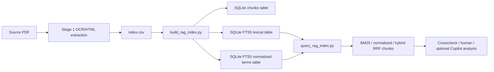
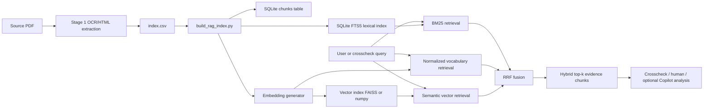

# RAG Project Structure

## Purpose

This document describes the current RAG pipeline implemented in this project and a possible extension toward semantic vector retrieval.

## Actual RAG Pipeline

The current project RAG pipeline is local, deterministic, and script-driven. It does not currently use FAISS, embeddings, or vector similarity search. Retrieval now supports lexical BM25, deterministic normalized-term retrieval, and hybrid RRF fusion between those two script-based channels.



## Current Index Location

Current manifest:

```text
artifacts/rag_DDS_STBIO1/index_manifest.json
```

Current SQLite index:

```text
artifacts/rag_DDS_STBIO1/rag_index.sqlite
```

Current source index:

```text
artifacts/stage1_requirements/ocr_extracts/index.csv
```

Current source document:

```text
specs/DDS_STBIO1.pdf
```

## Chunk Dimension

The actual chunking configuration is:

| Parameter | Value |
| --- | --- |
| Chunk size | `1200` characters |
| Chunk overlap | `150` characters |
| Pages indexed | `163` |
| Chunks indexed | `376` |
| Text chunks | `248` |
| Table chunks | `71` |
| Figure chunks | `57` |
| HTML clean mode | `true` |
| Normalized terms index | `chunk_terms_fts` |
| Fusion method | `RRF` for `--mode hybrid` |

Chunking is performed by `scripts/build_rag_index.py`. The script normalizes text, tries to end text chunks on a newline when possible, and uses overlap so that content near a text chunk boundary is not lost. Tables are emitted as atomic chunks from their caption through the detected table body boundary. Figures are emitted as figure chunks containing the figure caption, OCR text, and nearby contextual lines.

## Actual Retrieval Scheme

The current retrieval scheme has three deterministic modes:

- `lexical`: exact lexical retrieval with SQLite FTS5 and BM25 over original chunk text.
- `normalized`: deterministic retrieval over rule-based lemmas, acronyms, phrases, and controlled synonym groups.
- `hybrid`: RRF fusion of lexical and normalized retrieval rankings.

The default backend is local SQLite/FTS5 for backward compatibility. The backend is replaceable and is not workflow authority; authoritative workflow code must consume a bounded retrieval result/evidence interface rather than SQLite tables, FTS5 syntax, or query internals.

The lexical retrieval path is:

1. `scripts/query_rag_index.py` receives a query string.
2. It opens the configured SQLite RAG database.
3. It queries the FTS5 virtual table using `MATCH`.
4. It computes ranking with `bm25(chunk_fts)`.
5. It sorts by BM25 score.
6. It returns the top-k chunks with provenance, including page, section, and source type when present in the index.

The relevant query pattern is:

```sql
SELECT
    c.id,
    c.source_file,
    c.page,
    c.chunk_index,
    c.chunk_text,
    bm25(chunk_fts) AS score
FROM chunk_fts
JOIN chunks c ON c.id = CAST(chunk_fts.chunk_id AS INTEGER)
WHERE chunk_fts MATCH ?
ORDER BY score
LIMIT ?
```

This is a best-match lexical retrieval approach based on BM25. It is strong for exact requirement IDs, exact signal names, acronyms, normative words, section names, and technical terms.

The normalized retrieval path queries `chunk_terms_fts`, a second SQLite FTS5 table populated from `normalized_terms`. These terms are generated from the original chunk text using deterministic tokenization, light lemmatization rules, acronym expansion, phrase mappings, units, and controlled synonym groups loaded from `config/domain_vocabulary.json`. The normalized query uses `OR` between expanded terms so synonyms and lemmas broaden recall instead of requiring every expanded term to be present.

The hybrid path runs both lexical and normalized retrieval, then merges their ranks with Reciprocal Rank Fusion:

$$
RRF(d) = \sum_i \frac{1}{k + rank_i(d)}
$$

For the current implementation, $i$ is `lexical` and `normalized`; the default $k$ is `60`.

## Pipeline Elements

### 1. Source PDF

The approved primary source is the source-evidence baseline for OCR and retrieval preparation. Canonical workflow authority remains `data/canonical/canonical_store.sqlite`; the RAG index is derived and non-authoritative.

### 2. Stage 1 OCR/HTML Extraction

Stage 1 extracts text from the source document. The extraction output is tracked in `artifacts/stage1_requirements/ocr_extracts/index.csv`.

The index records page-level extraction metadata, including source file, page number, text file path, and extraction status.

### 3. Source Index CSV

The RAG builder reads the Stage 1 OCR index CSV. Only rows with successful text extraction are used for indexing.

### 4. RAG Builder

`scripts/build_rag_index.py` builds the local RAG index. Its responsibilities are:

- load project context
- locate the OCR index
- load extracted page text
- optionally prefer cleaned HTML page text when available
- normalize text
- split text into overlapping chunks
- generate deterministic normalized terms from controlled domain vocabulary
- write chunk metadata to SQLite
- write searchable text into SQLite FTS5
- write normalized terms into `chunk_terms_fts`
- write the RAG manifest

### 5. Chunk Store

The SQLite `chunks` table stores the chunk metadata and raw chunk text:

- chunk ID
- source file
- page
- section
- source type, such as `text`, `table`, or `figure`
- chunk index
- start character
- end character
- chunk text
- normalized terms
- extracted text file path

This table provides traceability from retrieved evidence back to the source page and text extraction artifact.

### 6. FTS5 Table

The SQLite `chunk_fts` virtual table stores searchable text for fast lexical retrieval.

It indexes:

- source file
- page
- chunk text

The `chunk_id` field is stored unindexed and used to join back to the metadata table.

### 7. Query Script

`scripts/query_rag_index.py` is the direct retrieval interface. It accepts:

- `--query`
- `--top-k`
- `--db-path`
- `--output`

It exports a Markdown report containing retrieved chunks, rank order, source file, page, chunk index, chunk ID, and BM25 score.

### 8. Consumers

Retrieved evidence can be consumed by:

- local crosscheck scripts
- generated Markdown reports
- human review
- optional Copilot or GUI-based analysis

In the standard deterministic CLI pipeline, retrieval and crosschecks are script-driven. An LLM is not the primary retrieval engine.

## Strengths Of The Current Scheme

- Simple and local.
- Deterministic and easy to audit.
- No model download is required.
- Very effective for exact IDs and technical terms.
- Results include explicit source provenance.
- SQLite keeps the implementation lightweight and portable.

## Current Limitations

- It does not yet perform embedding-based semantic vector search.
- It can still miss conceptually related text when no lemma, phrase mapping, or controlled synonym group connects the wording.
- It has no FAISS or vector similarity layer.
- Controlled synonym quality depends on the centralized approved vocabulary loaded through the approved vocabulary/resolver context. Vocabulary expansions are lexical retrieval aids, not normative evidence or workflow decisions.

## Possible Extension: Semantic Vector RAG

A useful future extension would keep the current BM25 plus normalized RRF implementation and add semantic vector retrieval as a third channel.



## Semantic Retrieval Addition

The semantic extension would add embeddings for each chunk.

Recommended script-level additions:

1. Add an optional embedding dependency, such as `sentence-transformers`, or another locally approved embedding backend.
2. Add embedding generation to `scripts/build_rag_index.py` or a separate `scripts/build_rag_vector_index.py`.
3. Store vector metadata using the existing `chunk_id` as the join key.
4. Store vectors in FAISS or in a `.npy` matrix plus metadata in SQLite.
5. Extend `scripts/query_rag_index.py` with semantic vector retrieval.
6. Extend the existing hybrid RRF mode so it can fuse BM25, normalized vocabulary retrieval, and semantic vector retrieval.

Possible new artifacts:

```text
artifacts/rag_DDS_STBIO1/vector.index
artifacts/rag_DDS_STBIO1/embeddings.npy
artifacts/rag_DDS_STBIO1/embedding_metadata.json
```

Possible manifest additions:

```json
{
    "retrieval_modes": ["lexical_bm25", "normalized_terms", "semantic_vector", "hybrid_rrf"],
  "embedding_model": "<local_embedding_model_name>",
  "embedding_dimension": 384,
  "vector_index_path": "artifacts/rag_DDS_STBIO1/vector.index",
  "fusion_method": "rrf",
  "rrf_k": 60
}
```

## How To Merge Semantic Retrieval With The Actual Implementation

The current implementation should not be replaced. The recommended approach is to add semantic retrieval beside the existing lexical and normalized retrieval channels.

### Step 1: Keep SQLite FTS5 As The Lexical Channel

The existing `chunk_fts` table remains the source for exact-term retrieval.

This preserves strong behavior for:

- requirement IDs
- source tags
- signal names
- register names
- block names
- exact normative phrases

### Step 2: Add A Vector Channel

Each row in `chunks` receives an embedding vector computed from `chunk_text`.

The vector index returns semantic nearest neighbors for a query embedding.

Semantic retrieval is useful for:

- synonyms
- concept search
- paraphrases
- source text that uses different wording than the query
- ontology discovery and crosscheck support

### Step 3: Use The Same `chunk_id`

Both channels must return the same stable `chunk_id` from the `chunks` table.

This allows lexical and semantic results to be merged without losing provenance.

### Step 4: Merge Rankings With RRF

Use Reciprocal Rank Fusion to combine BM25 and semantic results.

RRF formula:

$$
RRF(d) = \sum_i \frac{1}{k + rank_i(d)}
$$

Where:

- $d$ is a chunk
- $i$ is a retrieval channel
- $rank_i(d)$ is the rank of the chunk in that channel
- $k$ is a stabilizing constant, commonly `60`

With two channels:

$$
RRF(d) = \frac{1}{k + rank_{BM25}(d)} + \frac{1}{k + rank_{semantic}(d)}
$$

RRF is preferred here because BM25 scores and vector similarity scores do not share the same scale. RRF combines rank positions instead of raw scores.

### Step 5: Return Auditable Hybrid Results

Hybrid query output should include:

- final rank
- `chunk_id`
- source file
- page
- chunk index
- lexical rank, if present
- normalized rank, if present
- semantic rank, if a future vector channel is added
- BM25 score, if present
- normalized BM25 score, if present
- vector similarity score, if a future vector channel is added
- RRF score
- chunk text

### Step 6: Preserve Source-Backed Rules

Semantic retrieval should only broaden candidate evidence discovery. It must not create requirements or facts by itself.

Downstream generation or crosscheck must still require source-backed evidence with file/page/chunk provenance.

## Recommended Query Modes

`scripts/query_rag_index.py` now supports:

```text
--mode lexical
--mode normalized
--mode hybrid
--lexical-top-k 30
--normalized-top-k 30
--top-k 8
--rrf-k 60
```

A future embedding implementation may add `--mode semantic` or a separate vector option.

Recommended defaults:

| Option | Recommended default |
| --- | --- |
| `--mode` | `lexical` for backward compatibility; use `hybrid` for BM25 plus controlled normalized retrieval |
| `--lexical-top-k` | `30` |
| `--normalized-top-k` | `30` |
| `--top-k` | `8` |
| `--rrf-k` | `60` |

## Implementation Principle

The RAG extension should remain project-agnostic:

- no project names in retrieval logic
- no source-specific IDs in code
- no hardcoded device terms
- all paths loaded from runtime config or manifest
- all evidence tied back to `chunk_id`, source file, and page

## Summary

The actual RAG pipeline is a deterministic lexical RAG implementation using SQLite FTS5 and BM25. It is strong for exact terms and auditability. The most useful extension would be hybrid retrieval: keep BM25, add semantic vector search, and merge both ranked lists with RRF while preserving source provenance and deterministic output artifacts.