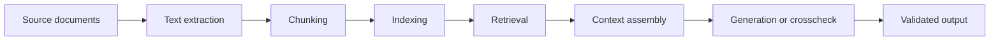

# Simplified Tutorial: Neural Networks, Learning Algorithms, and RAG

## Purpose

This tutorial introduces three related topics:

- basic neural network concepts
- learning algorithms used to train models
- retrieval-augmented generation, or RAG

The goal is to give a practical mental model without requiring advanced mathematics.

## 1. Basic Concepts Of Neural Networks

A neural network is a computational model that learns patterns from examples. It receives input data, transforms it through layers, and produces an output such as a class, a score, a prediction, or generated text.

### Neurons

A neuron is a small computation unit. It receives input values, multiplies them by weights, adds a bias, and applies an activation function.

Simplified formula:

$$
output = activation(w_1x_1 + w_2x_2 + ... + w_nx_n + b)
$$

Where:

- $x_i$ are input values
- $w_i$ are weights learned during training
- $b$ is a bias term
- `activation` is a function that introduces non-linear behavior

### Layers

Neural networks are organized into layers:

- **Input layer**: receives the raw input data.
- **Hidden layers**: transform the data into increasingly useful representations.
- **Output layer**: produces the final prediction or response.

For example, in a document-processing model, early layers may detect words or fragments, deeper layers may detect relationships, and final layers may predict meaning or relevance.

### Weights And Biases

Weights and biases are the internal parameters of the network. Training adjusts these parameters so the model produces better outputs.

At the beginning, the weights are usually not useful. After training on many examples, they encode patterns learned from data.

### Activation Functions

Activation functions allow the network to model complex relationships. Without them, stacked layers would behave like one simple linear transformation.

Common activation functions include:

- ReLU
- sigmoid
- tanh
- softmax for probability-like output distributions

### Training Data

Training data is the set of examples used to teach the model. Each example usually contains an input and an expected output.

Examples:

- image -> label
- sentence -> sentiment
- document chunk -> relevant or not relevant
- prompt -> expected answer

The quality, coverage, and correctness of training data strongly affect model behavior.

## 2. Learning Algorithms

A learning algorithm is the procedure used to adjust model parameters so the network improves over time.

### Loss Function

The loss function measures how wrong the model is.

Example:

- If the model predicts `0.9` and the correct answer is `1.0`, the loss is small.
- If the model predicts `0.1` and the correct answer is `1.0`, the loss is large.

Training tries to minimize this loss.

### Gradient Descent

Gradient descent is a common optimization method. It changes weights in the direction that reduces the loss.

Basic idea:

1. Run the model on training examples.
2. Measure the loss.
3. Compute how each weight contributed to the error.
4. Adjust weights slightly.
5. Repeat many times.

### Backpropagation

Backpropagation computes how much each parameter influenced the error. It works backward from the output layer to earlier layers.

This tells the optimizer which weights should increase or decrease.

### Learning Rate

The learning rate controls how big each parameter update is.

- Too high: training can become unstable.
- Too low: training can be very slow.
- Well tuned: the model improves steadily.

### Epochs And Batches

An **epoch** is one full pass through the training dataset.

A **batch** is a smaller group of examples processed together before updating the model.

Training usually uses many batches over many epochs.

### Overfitting And Generalization

Overfitting happens when a model memorizes training examples instead of learning general patterns.

A model generalizes well when it performs correctly on new data it has not seen before.

Common ways to reduce overfitting include:

- more diverse training data
- validation datasets
- regularization
- simpler models
- early stopping

## 3. What A RAG Pipeline Is

RAG means **retrieval-augmented generation**.

A RAG pipeline improves a language model response by retrieving relevant external information before generation. Instead of relying only on what the model already knows, the system gives it source-backed context.

In simple terms:

1. The user asks a question.
2. The system searches a knowledge base.
3. The most relevant chunks are retrieved.
4. The retrieved chunks are passed to a generator, often an LLM.
5. The generator answers using that evidence.

## 4. Main Components Of A RAG Pipeline

### Source Documents

These are the original materials used as knowledge sources.

Examples:

- specifications
- manuals
- PDFs
- Markdown files
- CSV tables
- requirements databases

The source documents should be preserved with provenance such as file name, page, section, row, or paragraph.

### Document Extraction

The pipeline extracts usable text from the source documents.

Depending on the file type, this may involve:

- native text extraction
- OCR for scanned PDFs
- HTML parsing
- table extraction
- cleanup of headers, footers, and noise

### Chunking

Documents are split into smaller pieces called chunks.

Chunking is needed because models and search systems work better with focused passages than with huge documents.

A chunk usually stores:

- chunk ID
- text
- source file
- page or section
- start and end position

### Indexing

Indexing prepares chunks for retrieval.

There are two common retrieval index types.

**Lexical index**:

- searches exact words or terms
- useful for IDs, signal names, acronyms, and exact phrases
- examples: SQLite FTS5, BM25, Elasticsearch

**Vector index**:

- stores embeddings of chunks
- searches by meaning rather than exact wording
- useful for synonyms and concept-level matches
- examples: FAISS, HNSW, vector databases

### Embeddings

An embedding is a numeric vector that represents the meaning of text.

Texts with similar meaning should have vectors close to each other.

Example:

- `power startup sequence`
- `boot phase and power-up behavior`

These phrases use different words but may be close in embedding space.

### Retrieval

Retrieval selects the most relevant chunks for a query.

Common retrieval modes:

- **lexical retrieval**: keyword and exact-term matching
- **semantic retrieval**: embedding similarity search
- **hybrid retrieval**: combines lexical and semantic results

### Ranking And Fusion

When multiple retrieval methods are used, their results must be combined.

A common method is **Reciprocal Rank Fusion**, or RRF:

$$
RRF(d) = \sum_i \frac{1}{k + rank_i(d)}
$$

Where:

- $d$ is a retrieved chunk
- $i$ is a retrieval method, such as BM25 or vector search
- $rank_i(d)$ is the rank of chunk $d$ in method $i$
- $k$ is a constant, often around `60`

RRF is useful because it combines rankings without requiring BM25 scores and vector similarity scores to use the same scale.

### Context Assembly

The top retrieved chunks are assembled into a context package.

Good context includes:

- chunk text
- source file
- page or section
- retrieval score or rank
- reason for inclusion when available

This makes the final answer easier to audit.

### Generation

The generator, often an LLM, receives the user question plus retrieved context.

The generator should answer using the retrieved evidence. In engineering workflows, it should not invent requirements or facts that are not supported by the source chunks.

### Crosscheck And Validation

For regulated or engineering workflows, generation should be followed by validation.

Crosschecks can verify:

- whether the answer cites source-backed evidence
- whether requirement IDs are preserved correctly
- whether generated statements are traceable
- whether mandatory source content was missed
- whether the output violates project rules

## 5. Simple RAG Flow Diagram



## 6. Lexical, Semantic, And Hybrid Retrieval

### Lexical Retrieval

Lexical retrieval matches text directly.

It is strong when the query contains exact identifiers or technical tokens.

Example query:

```text
DDS_STBIO1_0104 clock gating
```

Lexical retrieval is likely to find chunks containing those exact terms.

### Semantic Retrieval

Semantic retrieval searches by meaning.

It is strong when the query and source use different wording for the same concept.

Example query:

```text
startup power sequencing
```

It may retrieve chunks about:

```text
BOOT phase, POR release, power-up configuration
```

### Hybrid Retrieval

Hybrid retrieval uses both methods.

Recommended behavior:

1. Run lexical retrieval for precision.
2. Run semantic retrieval for recall.
3. Fuse the ranked results, for example with RRF.
4. Return source-backed chunks with provenance.
5. Let downstream generation or crosscheck use only verified retrieved evidence.

## 7. Deterministic Semantic Retrieval Without Generation

In the strict meaning of RAG, the final **generation** step is usually performed by a language model. However, a retrieval system can still use semantic techniques without making any generative-model or external-service calls.

For this type of system, more precise names are:

- **deterministic semantic retrieval layer**
- **semantic enhancement layer**
- **RAG-like retrieval pipeline**

The pipeline may provide:

- better lexical and semantic retrieval
- local embedding generation
- exact cosine or approximate nearest-neighbor search
- deterministic reranking
- evidence aggregation
- Reciprocal Rank Fusion across retrieval channels
- source-backed explainability and scoring

It does not provide generated natural-language answers. Instead, it returns ranked evidence for a downstream consumer such as a reviewer, rules engine, requirements mapper, report generator, or optional future language model.

The boundary is therefore:

```text
Source documents
-> extraction and chunking
-> lexical and normalized retrieval
-> local semantic embeddings
-> cosine or ANN search
-> deterministic reranking and RRF fusion
-> traceable evidence package
```

This architecture has no LLM dependency and can be benchmarked using retrieval metrics such as Recall@k, mean reciprocal rank, latency, and index size. If a later workflow adds an LLM to generate an answer from the evidence package, that complete workflow can then be called RAG.

## 8. Why RAG Is Useful

RAG is useful because it separates knowledge retrieval from answer generation.

Benefits:

- keeps answers grounded in current project documents
- reduces reliance on model memory
- improves traceability
- supports source citations and review
- can be updated by rebuilding the index instead of retraining a model
- helps find relevant evidence across large documents

## 9. Key Takeaways

- A neural network learns patterns by adjusting weights from examples.
- Learning algorithms minimize error through optimization methods such as gradient descent and backpropagation.
- RAG retrieves relevant source chunks before generation or validation.
- Lexical retrieval is best for exact terms and IDs.
- Semantic retrieval is best for meaning-based search.
- Hybrid retrieval combines both and is often the strongest practical approach.
- In engineering workflows, retrieved evidence should remain traceable to source files, pages, sections, and chunk IDs.
- A system without a generative model is more precisely described as deterministic semantic retrieval, semantic enhancement, or RAG-like retrieval.
- Local embeddings, cosine or ANN search, reranking, evidence aggregation, and RRF can improve retrieval without LLM calls.

## 10. NLP (Natural Language Processing)

Lo **stemming** e la **lemmatizzazione** sono due tecniche di **NLP (Natural Language Processing)** usate per ridurre le parole alla loro forma base, così da confrontarle e analizzarle più facilmente.

## Stemming
Lo **stemming** taglia la parola in modo un po’ “meccanico”, rimuovendo suffissi o parti finali.

- **running** → **run**
- **studies** → **studi**
- **connected** → **connect**

### Caratteristiche
- È veloce
- Non sempre produce una parola “vera”
- È più aggressivo e meno preciso

---

## Lemmatizzazione
La **lemmatizzazione** cerca la **forma lessicale corretta** della parola, cioè il suo **lemma**.

- **running** → **run**
- **better** → **good**
- **cars** → **car**

### Caratteristiche
- È più precisa
- Richiede spesso un dizionario o analisi grammaticale
- Tiene conto del contesto

---

## Differenza principale
- **Stemming** = riduzione “grezza” della parola
- **Lemmatizzazione** = riduzione “intelligente” alla forma corretta

---

## Esempio semplice
Frase:

> “The cats are running faster”

- **Stemming**: `the`, `cat`, `are`, `run`, `faster`
- **Lemmatizzazione**: `the`, `cat`, `be`, `run`, `fast`

---

## Quando si usano
- **Stemming**: quando serve velocità e va bene una semplificazione approssimativa
- **Lemmatizzazione**: quando serve più accuratezza, ad esempio in classificazione testi, search, analisi semantica

Se vuoi, posso anche farti una **tabella comparativa** oppure mostrarti un esempio in **Python con NLTK / spaCy**.

Per il tuo caso, la strategia migliore è **mixed**, ma con **lemmatization come asse principale** e **stemming solo in modo molto limitato o come fallback**.

## Raccomandazione netta
Per documenti tecnici in inglese di:
- microelettronica
- system
- mechanical
- analog
- power
- digital

e con obiettivi di:
- comprensione di specifiche tecniche
- estrazione requisiti da testo, tabelle e immagini
- generazione di nuovi documenti basati sui requisiti

la scelta migliore è:

**lemmatization-first + domain ontology + synonym management + rule-based normalization**

non **stemming** come tecnica principale.

---

## Perché la lemmatizzazione è più adatta
Nel tuo scenario servono:
- **precisione dei dettagli**
- **buona associazione semantica**
- **riduzione delle forme grammaticali senza perdere significato**
- **gestione di termini tecnici e varianti morfologiche**

La lemmatizzazione:
- preserva meglio il senso rispetto allo stemming
- è più adatta all’estrazione requisiti
- riduce il rumore nei confronti tra termini
- è migliore per costruire indici e matching affidabili

Esempi:
- `drives`, `driven`, `driving` → `drive`
- `requirements` → `requirement`
- `specifications` → `specification`

Questo aiuta molto quando devi confrontare frasi, requisiti, tabelle e annotazioni.

---

## Perché non usare solo stemming
Lo stemming è troppo aggressivo per testi tecnici:
- può troncare parole importanti
- può creare forme poco leggibili
- può unire termini diversi in modo improprio
- aumenta il rischio di false associazioni

Esempio:
- `connected`, `connection`, `connector` possono essere trattati in modo troppo simile, ma nel dominio tecnico non sempre sono equivalenti.

Quindi lo stemming da solo **non è ideale** per il tuo obiettivo.

---

## Strategia migliore: mixed, ma ben controllata
Quando dico **mixed**, intendo:

### 1) Normalizzazione lessicale principale
- lowercase
- rimozione rumore
- tokenizzazione
- lemmatizzazione con POS tagging

### 2) Dizionario tecnico di dominio
Fondamentale per:
- sigle
- acronimi
- unità di misura
- termini multi-word
- termini che non vuoi lemmatizzare in modo aggressivo

Esempi:
- `PLL`, `LDO`, `ESD`, `ADC`, `DAC`, `MOSFET`
- `supply voltage`
- `junction temperature`
- `power dissipation`
- `clock jitter`

### 3) Sinonimi controllati
Per la ricerca dei sinonimi, non affidarti solo al modello linguistico generale. Serve un layer dedicato:
- dizionario sinonimi di dominio
- mapping controllato
- ontologia o thesaurus tecnico

Esempio:
- `specification`, `requirement`, `constraint` non sono sinonimi perfetti, ma in certi contesti vanno collegati con regole precise
- `chip`, `IC`, `integrated circuit` possono essere mappati solo se il contesto lo consente

### 4) Matching ibrido
Usa 3 livelli:
- **exact match**
- **lemma match**
- **synonym/concept match**

Questo ti dà sia precisione sia copertura.

---

## Per il tuo caso specifico: cosa consiglierei davvero
Dato che devi fare:
- comprensione delle specifiche
- estrazione requisiti
- analisi di testo, tabelle e immagini
- generazione documenti nuovi

la pipeline ideale è:

### A. Estrazione e normalizzazione
- OCR / parsing tabelle / estrazione testo da immagini
- pulizia
- segmentazione in frasi e blocchi
- lemmatizzazione

### B. Arricchimento semantico
- POS tagging
- riconoscimento entità tecniche
- dizionario di dominio
- sinonimi controllati
- relation extraction leggera basata su regole

### C. Ranking dei concetti
- priorità a termini tecnici esatti
- secondariamente lemmatizzati
- terzi sinonimi approvati dal dizionario di dominio

### D. Generazione documenti
- usa i requisiti estratti come strutture semantiche
- mantieni tracciabilità verso la fonte
- non generare testo solo da keyword, ma da concetti normalizzati

---

## In pratica: lemmatizzazione o mixed?
### Se devi scegliere una sola risposta:
**mixed, con lemmatization-first**

### Formula pratica:
- **lemmatization** = base
- **stemming** = quasi mai, solo fallback sperimentale
- **synonyms** = dizionario/ontologia di dominio
- **multi-word terms** = protezione speciale
- **acronyms** = non alterare

---

## Suggerimento architetturale
Per il tuo scopo, io imposterei così:

```text
Input: testo, tabelle, immagini
→ Estrazione testo/OCR
→ Cleaning e segmentation
→ POS tagging
→ Lemmatization
→ NER tecnico + phrase mining
→ Domain dictionary normalization
→ Synonym expansion controllata
→ Requirement extraction
→ Knowledge store / traceability
→ Document generation
```

---

## Decisione finale
**Scelta consigliata: mixed, con lemmatizzazione come metodo principale.**

È la soluzione più adatta se vuoi:
- precisione
- robustezza
- buona associazione semantica
- ricerca sinonimi
- supporto all’estrazione requisiti da documenti tecnici complessi

Se vuoi, posso anche prepararti:
1. una **pipeline software concreta**, oppure  
2. una **matrice decisionale lemmatization vs mixed vs stemming** per il tuo caso d’uso.

Per il tuo caso, la strategia migliore è mixed, ma con lemmatization come asse principale e stemming solo in modo molto limitato o come fallback.

Raccomandazione netta
Per documenti tecnici in inglese di:

microelettronica
system
mechanical
analog
power
digital
e con obiettivi di:

- comprensione di specifiche tecniche
- estrazione requisiti da testo, tabelle e immagini
- generazione di nuovi documenti basati sui requisiti
la scelta migliore è:

# lemmatization-first + domain ontology + synonym management + rule-based normalization

non stemming come tecnica principale.

## Perché la lemmatizzazione è più adatta
Nel tuo scenario servono:

- precisione dei dettagli
- buona associazione semantica
- riduzione delle forme grammaticali senza perdere significato
- gestione di termini tecnici e varianti morfologiche
La lemmatizzazione:

preserva meglio il senso rispetto allo stemming
è più adatta all’estrazione requisiti
riduce il rumore nei confronti tra termini
è migliore per costruire indici e matching affidabili
Esempi:

drives, driven, driving → drive
requirements → requirement
specifications → specification
Questo aiuta molto quando devi confrontare frasi, requisiti, tabelle e annotazioni.

Perché non usare solo stemming
Lo stemming è troppo aggressivo per testi tecnici:

può troncare parole importanti
può creare forme poco leggibili
può unire termini diversi in modo improprio
aumenta il rischio di false associazioni
Esempio:

connected, connection, connector possono essere trattati in modo troppo simile, ma nel dominio tecnico non sempre sono equivalenti.
Quindi lo stemming da solo non è ideale per il tuo obiettivo.

Strategia migliore: mixed, ma ben controllata
Quando dico mixed, intendo:

1) Normalizzazione lessicale principale
lowercase
rimozione rumore
tokenizzazione
lemmatizzazione con POS tagging
2) Dizionario tecnico di dominio
Fondamentale per:

sigle
acronimi
unità di misura
termini multi-word
termini che non vuoi lemmatizzare in modo aggressivo
Esempi:

PLL, LDO, ESD, ADC, DAC, MOSFET
supply voltage
junction temperature
power dissipation
clock jitter
3) Sinonimi controllati
Per la ricerca dei sinonimi, non affidarti solo al modello linguistico generale. Serve un layer dedicato:

dizionario sinonimi di dominio
mapping controllato
ontologia o thesaurus tecnico
Esempio:

specification, requirement, constraint non sono sinonimi perfetti, ma in certi contesti vanno collegati con regole precise
chip, IC, integrated circuit possono essere mappati solo se il contesto lo consente
4) Matching ibrido
Usa 3 livelli:

- exact match
- lemma match
- synonym/concept match
Questo ti dà sia precisione sia copertura.

Per il tuo caso specifico: cosa consiglierei davvero
Dato che devi fare:

comprensione delle specifiche
estrazione requisiti
analisi di testo, tabelle e immagini
generazione documenti nuovi
la pipeline ideale è:

# A. Estrazione e normalizzazione
- OCR / parsing tabelle / estrazione testo da immagini
- pulizia
- segmentazione in frasi e blocchi
- lemmatizzazione
# B. Arricchimento semantico
POS tagging
riconoscimento entità tecniche
dizionario di dominio
sinonimi controllati
relation extraction leggera basata su regole
# C. Ranking dei concetti
priorità a termini tecnici esatti
secondariamente lemmatizzati
terzi sinonimi approvati dal dizionario di dominio
# D. Generazione documenti
usa i requisiti estratti come strutture semantiche
mantieni tracciabilità verso la fonte
non generare testo solo da keyword, ma da concetti normalizzati
In pratica: lemmatizzazione o mixed?
Se devi scegliere una sola risposta:
mixed, con lemmatization-first

# Formula pratica:
- lemmatization = base
- stemming = quasi mai, solo fallback sperimentale
- synonyms = dizionario/ontologia di dominio
- multi-word terms = protezione speciale
- acronyms = non alterare
Suggerimento architetturale
Per il tuo scopo, io imposterei così:

text
Input: testo, tabelle, immagini
→ Estrazione testo/OCR
→ Cleaning e segmentation
→ POS tagging
→ Lemmatization
→ NER tecnico + phrase mining
→ Domain dictionary normalization
→ Synonym expansion controllata
→ Requirement extraction
→ Knowledge store / traceability
→ Document generation

# Decisione finale
Scelta consigliata: mixed, con lemmatizzazione come metodo principale.

È la soluzione più adatta se vuoi:

precisione
robustezza
buona associazione semantica
ricerca sinonimi
supporto all’estrazione requisiti da documenti tecnici complessi
Se vuoi, posso anche prepararti:

una pipeline software concreta, oppure
una matrice decisionale lemmatization vs mixed vs stemming per il tuo caso d’uso.