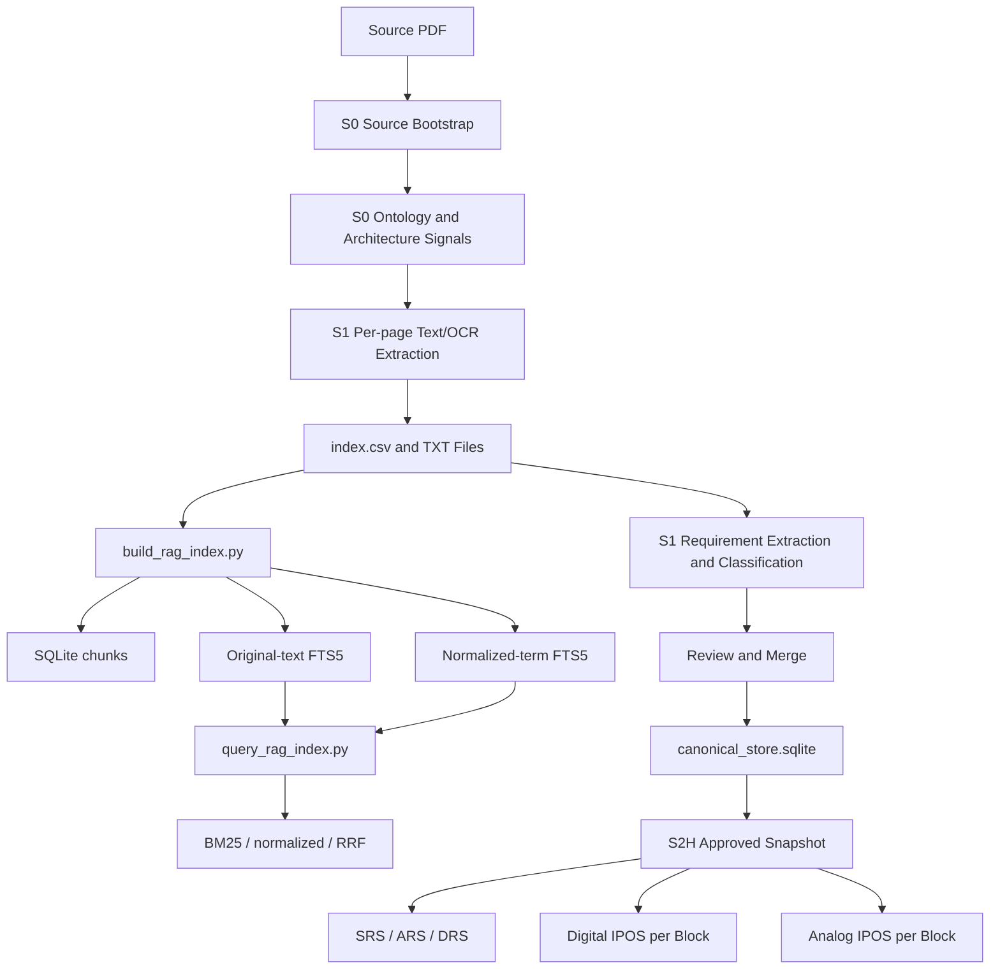

# From PDF Specification to Canonical Database and RAG Pipeline

## 1. Summary

The workflow starts at Stage 0 and transforms a PDF specification into requirements, architectural evidence, a canonical workflow database, a local RAG index, and downstream specifications.



The system maintains separate layers:

| Layer | Purpose | Authority |
|---|---|---|
| PDF and source files | Original source | Original source authority |
| OCR index and TXT files | Extracted text and page provenance | Derived evidence |
| RAG SQLite/FTS5 | Local chunk retrieval | Derived and rebuildable |
| `canonical_store.sqlite` | Requirements, revisions, approvals, and mappings | Workflow authority |
| Approved snapshot | Immutable input for generation | Generation authority |
| Markdown/CSV/DOCX | Generated specifications and reports | Derived outputs |

The RAG index does not approve requirements and does not modify the canonical database. The approved snapshot is the boundary between review and authoritative generation.

## 2. Stage 0: Source Bootstrap

### Files

- `scripts/run_stage0_gate0.py`
- `scripts/s0_source_bootstrap.py`
- `scripts/generate_stage0_ontology_outputs.py`
- `scripts/generate_stage0_ontology_report.py`
- `scripts/validate_stage0_gate.py`
- `config/project_context.json`
- `config/ontology_role_taxonomy.json`

### Operations

1. Resolve the active project and configured source.
2. Verify that the PDF exists and is readable.
3. Calculate the source fingerprint.
4. Register the project, specification, revision, and ingestion batch.
5. Record bootstrap events in the canonical database.
6. Prepare the ontology analysis.
7. Apply Gate 0.

Stage 0 uses the PDF as its source, but it does not yet create the final requirements table.

### Ontology evidence

Stage 0 extracts evidence for:

- entities;
- blocks and architectural roles;
- functions;
- properties;
- relationships;
- interfaces;
- signals;
- protocols;
- analog and digital indicators;
- tables and figures;
- operating modes and power states described by the source.

Ontology evidence supports classification and mapping, but it cannot invent blocks or requirements that are not supported by the source.

## 3. Stage 1: PDF Text Extraction

### Files

- `scripts/extract_requirements_ocr.py`
- `scripts/ingest_source_spec.py`
- `artifacts/stage1_requirements/ocr_extracts/index.csv`

Source selection follows this order:

1. `--initial-spec`;
2. legacy alias `--initial-pdf`;
3. `source_spec_path` in `config/project_context.json`;
4. the first supported file found in `specs/`.

Supported source types are PDF, HTML, and DOCX. For a PDF, `pypdf.PdfReader` reads every page and produces a separate text file:

```text
artifacts/stage1_requirements/ocr_extracts/<source>_p001.txt
artifacts/stage1_requirements/ocr_extracts/<source>_p002.txt
...
```

Each page is recorded with:

```text
source_file
page
text_file
status
```

If a page has no extractable text, the system emits an `empty-page` marker and records that an image OCR engine may be required. GUI PDF reading is separate from this procedure and does not automatically start Stage 0 or Stage 1.

## 4. Stage 1: Requirement Extraction

### Files

- `scripts/generate_stage1_requirements.py`
- `scripts/crosscheck_stage1_requirements_rag.py`
- `scripts/run_stage1_requirements_gate1.py`
- `scripts/validate_stage1_gate.py`

### Extraction algorithms

The extractor applies deterministic rules for:

- configured requirement-ID recognition;
- `Requirement` marker recognition;
- detection of `shall`, `must`, `required`, and equivalent forms;
- detection of limits, ranges, conditions, and prohibitions;
- recognition of normative table rows;
- reconstruction of text split across lines or pages;
- exclusion of headings, metadata, references, and non-normative text.

Each candidate retains its ID, statement, category, page, line, table/section context, and reconstruction notes.

### Outputs

```text
artifacts/stage1_requirements/requirements_raw.md
artifacts/stage1_requirements/requirements_summary.csv
artifacts/stage1_requirements/requirements_summary.md
artifacts/stage1_requirements/requirements_rag_crosscheck.md
artifacts/stage1_requirements/coverage_crosscheck.md
```

Gate 1 blocks substantive duplicate IDs, truncated text, missing provenance, and insufficient coverage.

## 5. RAG Index Construction

### Files

- `scripts/build_rag_index.py`
- `config/project_context.json`
- `config/retrieval_config.json`
- `scripts/approved_vocabulary.py`

### Inputs

The builder reads:

- the configured `ocr_index_path`;
- per-page TXT files;
- the HTML/PDF source when a higher-fidelity representation is available;
- the approved vocabulary.

### Construction algorithms

#### 5.1 Sliding-window chunking with overlap

Text is divided into configurable chunks. The documented current configuration uses:

- chunk size: `1200` characters;
- overlap: `150` characters.

Overlap prevents information near chunk boundaries from being lost.

Tables and figures may be handled as structural chunks, preserving captions, OCR content, and associated context.

Each chunk retains:

```text
source_file
page
section
source_type
chunk_index
start_char
end_char
chunk_text
text_file
```

#### 5.2 Deterministic tokenization

The `_tokenize_terms` algorithm:

1. separates words joined by `-` or `/` when appropriate;
2. replaces punctuation with spaces;
3. retains alphanumeric and underscore tokens;
4. converts tokens to lowercase.

#### 5.3 Light normalization and lemmatization

The `_simple_lemma` algorithm applies deterministic rules:

- maps irregular forms such as `configured -> configure`;
- removes applicable `-ing`, `-ed`, `-ies`, and `-s` suffixes;
- preserves short tokens and tokens containing digits;
- protects acronyms and approved terms.

#### 5.4 Controlled vocabulary processing

The `_controlled_terms` algorithm adds, when configured:

- original tokens;
- lemmas;
- acronyms and expansions;
- synonym groups;
- phrase mappings;
- measurement units;
- protected terms;
- while excluding approved stopwords.

The result is stored in `normalized_terms`.

### RAG SQLite tables

`build_rag_index.py` creates:

```sql
chunks
chunk_fts        -- SQLite FTS5 over original text
chunk_terms_fts  -- SQLite FTS5 over normalized terms
```

The manifest records the build configuration, including chunking, source, vocabulary, and normalized-term indexing.

## 6. RAG Querying

### Files

- `scripts/query_rag_index.py`
- `retrieval/fusion.py`
- `retrieval/semantic_index.py`
- `retrieval/embeddings.py`

### 6.1 Lexical FTS5 and BM25 query

The `lexical` mode queries `chunk_fts`:

```sql
SELECT
    c.id,
    c.source_file,
    c.page,
    c.section,
    c.source_type,
    c.chunk_index,
    c.chunk_text,
    bm25(chunk_fts) AS score
FROM chunk_fts
JOIN chunks c ON c.id = CAST(chunk_fts.chunk_id AS INTEGER)
WHERE chunk_fts MATCH ?
ORDER BY score
LIMIT ?
```

Algorithms used:

- SQLite FTS5 `MATCH`;
- BM25 ranking through `bm25(chunk_fts)`;
- score ordering;
- top-k selection.

This mode is effective for exact IDs, signals, acronyms, technical terms, headings, and normative words.

### 6.2 Normalized-term query

The `normalized` mode:

1. normalizes the query with the approved vocabulary;
2. generates tokens and lemmas;
3. expands acronyms, synonyms, and phrases;
4. builds an `OR` query through `_fts_or_query`;
5. queries `chunk_terms_fts`;
6. applies BM25 ranking again.

Conceptual example:

```text
sample OR sampling OR configure OR configuration
```

This improves recall compared with exact original-text matching alone.

### 6.3 Hybrid query with Reciprocal Rank Fusion

The `hybrid` mode runs both:

- lexical retrieval;
- normalized-term retrieval.

Results are combined by `_rrf_fuse` using Reciprocal Rank Fusion:

$$
RRF(d) = \sum_i \frac{1}{k + rank_i(d)}
$$

In the implementation:

- `i` represents the lexical or normalized channel;
- the default `k` is `60`;
- results are ordered by `rrf_score`;
- `chunk_id` is used as a stable tie-breaker;
- the final top-k results are returned.

RRF combines rankings without directly comparing BM25 scores produced by different channels.

### 6.4 Optional semantic retrieval

The project also contains local components for:

- local embeddings;
- an exact cosine index;
- semantic search;
- `hybrid-semantic` fusion.

Semantic retrieval is optional and is not the primary deterministic path. It may be used:

- when explicitly configured;
- as widening or fallback when lexical/normalized retrieval returns no result;
- while preserving evidence, provenance, and deterministic eligibility checks.

Semantic similarity alone cannot create authority and is not sufficient to assign a requirement to a block.

## 7. Shared Canonical Database

### Files

- `scripts/canonical_store.py`
- `scripts/requirement_corpus.py`
- `scripts/merge_engine.py`
- `scripts/architecture_review.py`
- `scripts/impact_analysis.py`

### Database

```text
data/canonical/canonical_store.sqlite
```

This is the authoritative workflow database. The RAG SQLite database is separate and rebuildable.

### Staged-to-canonical transition

```text
staged_requirements
        ↓ review
canonical_requirements
        ↓ revisions
canonical_requirement_revisions
        ↓ provenance
requirement_provenance
```

The database stores:

- source text and IDs;
- revisions;
- approved classifications;
- classification method and confidence;
- source page, section, and chunk;
- architecture mappings;
- review decisions;
- workflow state;
- audit events.

CSV, JSON, Markdown, XLSX, and RAG SQLite files are exports or derived indexes; they do not replace the canonical database.

## 8. Review, Mapping, and Snapshot

### Files

- `scripts/run_stage2_micro_arch_and_crosscheck.py`
- `scripts/freeze_stage2b_snapshot.py`
- `scripts/snapshot_manager.py`
- `scripts/approved_snapshot_resolver.py`

Requirement-to-block mapping combines:

1. Stage 0 ontology evidence;
2. architectural roles;
3. functions and properties;
4. interfaces;
5. relationships;
6. approved vocabulary and taxonomy;
7. controlled lexical matching;
8. user review for ambiguity.

After approval, `snapshot_manager.py` creates a snapshot with fingerprints for:

- canonical revisions;
- approved mappings;
- profiles;
- taxonomy;
- vocabulary;
- retrieval configuration;
- semantic flags.

The snapshot is resolved with:

```text
--snapshot-id <id>
```

or:

```text
--use-latest-approved
```

## 9. Authoritative Querying and Generation

### Files

- `scripts/approved_snapshot_resolver.py`
- `scripts/requirement_corpus.py`
- `scripts/run_srs_gen_spec_agent.py`
- `scripts/run_ars_gen_spec_agent.py`
- `scripts/run_drs_gen_spec_agent.py`
- `scripts/generate_ipos_specs.py`

Downstream generators:

1. resolve an approved snapshot;
2. materialize canonical requirements;
3. retrieve approved mappings and provenance;
4. load block inventory, interfaces, and interaction matrices;
5. generate SRS, ARS, DRS, or IPOS;
6. produce traceability and reports;
7. run gates.

The RAG may be queried for evidence and crosschecks, but it cannot modify:

- canonical requirements;
- IDs;
- approvals;
- mappings;
- snapshots;
- coverage denominators.

Digital and Analog IPOS are generated per block:

```text
artifacts/stage6_digital_ipos/blocks/<block-slug>/
artifacts/stage7_analog_ipos/blocks/<block-slug>/
```

Titles are:

```text
Digital IPOS - <block name>
Analog IPOS - <block name>
```

## 10. Main Commands

```text
python scripts/run_stage0_gate0.py
python scripts/run_stage1_requirements_gate1.py
python scripts/build_rag_index.py
python scripts/query_rag_index.py --query "shall OR must" --mode hybrid --top-k 10
python scripts/run_stage2_micro_arc_gate.py
python scripts/freeze_stage2b_snapshot.py
python scripts/run_stage3_srs_gate.py
python scripts/run_stage4_ars_gate.py
python scripts/run_stage5_drs_gate.py
python scripts/generate_ipos_specs.py --kind digital --use-latest-approved
python scripts/generate_ipos_specs.py --kind analog --use-latest-approved
```

## 11. Authority Rule

The authoritative sequence is:

```text
PDF
 → Stage 0 bootstrap and ontology
 → Stage 1 OCR and requirements
 → Stage 1 RAG and crosscheck
 → Stage 2 classification and architecture
 → review and approval
 → canonical_store.sqlite
 → approved immutable snapshot
 → SRS / ARS / DRS / IPOS
```

The RAG is used to search and verify evidence. The canonical database stores workflow authority. The approved snapshot makes downstream generation reproducible.
