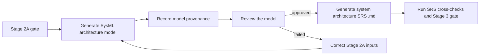

# Stage 2 Runbook (Specification Formalization and Architecture Mapping)

## Inputs
- `artifacts/stage1_requirements/requirements_summary.csv`
- `artifacts/stage0_ontology/semantic_issues.md`
- `artifacts/stage0_ontology/ontology_requirement_links.csv`
- `config/stage2_mirco_arc_profile.json`

Supplementary source review is an additive step after the primary source has
completed Stage 2. Approved rows are added to the updated integrated source
baseline. This is an incremental dependent-stage refresh/recompute, not a
destructive restart. It invalidates the current canonical corpus, architecture
review mapping, approved mapping snapshot, hierarchical specifications, and
SysML traceability outputs; regenerate them through Stage 0, Stage 1
(including OCR/tag refresh), and Stage 2 before continuing to architecture map
review and Stage 2A.

Prior approvals, review workbooks, workflow manifests, and generated artifact
history remain available for audit. Since the evidence changed, the refreshed
mapping and approval snapshot require new reviewer approval and hashes; prior
approvals remain historical records and are not reused as current approval.

## Steps
1. Normalize requirement wording and preserve requirement IDs
2. Define acceptance tests for each requirement
3. Define at least one assertion per requirement
4. Build traceability seed for downstream stages
5. Generate `artifacts/stage1_specs/architecture_profile_draft.json` from Stage 1 source-owner evidence.
6. Generate `artifacts/stage1_specs/architecture_profile_approval_request.md` with the required user review action.
7. Generate editable `artifacts/stage1_specs/architecture_mapping_preview.csv` with preliminary requirement-ID-to-candidate-block assignments, source classification, editable approved classification, generated block paragraph previews, review decisions, approved block, and reviewer notes.
8. Generate final summary tables and traceability outputs for the approval package.
9. User reviews, completes, and approves `config/stage2_mirco_arc_profile.json`.

## Required Architecture Profile Approval

Stage 2A requirement-to-block mapping is blocked until the user approves the
architecture profile. The user shall review and edit the generated CSV mapping
preview, generated draft, generated block paragraph previews, Stage 0 ontology
links, and Stage 1 requirements, then update
`config/stage2_mirco_arc_profile.json` with approved real device blocks,
functions, inputs, outputs, aliases, mapping rules, interactions, and approved
requirement ownership.

The mapping preview CSV `review_decision` column accepts `approved`,
`reassigned`, `rejected`, and `needs_clarification`. Gate enablement accepts
`approved` or `reassigned`. The `approved_block` field may contain either an
exact approved real block or a matching top-level route: `System`, `Digital`, or
`Analog`. Top-level routes are not SysML blocks: `System` is retained for SRS,
`Digital` for DRS, and `Analog` for ARS. Rows left as `pending_review`,
`rejected`, or `needs_clarification` keep Stage 2A blocked.

### Mandatory Workbook Synchronization Directive

`architecture_mapping_preview.xlsx` is the editable review surface and
`architecture_mapping_preview.csv` is the authoritative machine-readable
handoff. After saving and closing the workbook, synchronize it to the CSV before
Stage 2A approval, Stage 2A execution, or Stage 2B snapshot freezing. The sync
rejects duplicate, missing, unknown, unsaved, or mismatched requirement rows,
derives `approved` only when `approved_block` is non-empty, and verifies that
all workbook block assignments persist to the CSV. A stale CSV never substitutes
for the saved workbook.

Supplementary source requirements follow the same inventory rule: their IDs must
be checked against already-defined architecture blocks. The generator may propose
an existing block from normalized source-ID evidence and derive Analog, Digital,
or System from source metadata or block/requirement evidence, but it must never
invent a block. Insufficient evidence remains a user-review item.

The CSV initializes `candidate_classification` and editable
`approved_classification` from the Stage 1 requirement category. Every reviewed
row must set `approved_classification` to `Analog`, `Digital`, or `System`.

The profile approval record must contain:

```json
"approval": {
	"status": "approved",
	"approved_by": "<reviewer>",
	"approved_at": "<date or timestamp>",
	"reviewer_notes": "<optional approval notes>",
	"reviewed_draft_profile_sha256": "<current architecture_profile_draft.json sha256>",
	"reviewed_mapping_preview_csv_sha256": "<current architecture_mapping_preview.csv sha256>",
	"evidence_hashes": {
		"requirements_summary_csv": {"path": "artifacts/stage1_requirements/requirements_summary.csv", "sha256": "<sha256>"},
		"ontology_requirement_links_csv": {"path": "artifacts/stage0_ontology/ontology_requirement_links.csv", "sha256": "<sha256>"},
		"semantic_issues_md": {"path": "artifacts/stage0_ontology/semantic_issues.md", "sha256": "<sha256>"}
	}
}
```

Critical and major `ambiguity_dispositions` entries must be `resolved` or
`waived`; waived entries require rationale. Minor entries are informational.
Text, table, and figure extraction completeness is intentionally not enforced by
this approval gate. Until these fields and dispositions are complete and fresh,
Stage 2A stops before any requirement ID is mapped. This is an explicit forward
handoff, not an automatic Stage 2A retry or loop.

## Stage 2A Mapping Sequence

Run `scripts/run_stage2_micro_arc_gate.py` after Stage 2 formalization. The micro-architecture step must execute this sequence:

1. Load Stage 1 requirements, the Stage 0 ontology links, and the current project architecture profile.
2. Build the block inventory from configured blocks, source architecture actors, and interaction evidence.
3. Resolve explicit source-section owners and configured aliases.
4. Cascade the nearest meaningful parent paragraph title through numbered child items and continuation pages.
5. Treat generic clock/reset paragraphs and requirements as PMU/power-management clock-reset unit ownership when the project profile defines `PMU` and the source or statement carries PMU, clock, reset, resetn, rst_n, POR, or clock/reset parent-title evidence.
6. Treat a parent title without a configured block owner as non-specific source context; child requirements inherit that context.
7. Compare ontology role, relationship, and function/property evidence with each candidate block's `Function`, `Inputs`, `Outputs`, mapping rules, and aliases.
8. Map only semantically compatible requirements to concrete inventory items; use lexical mapping only when ontology evidence does not yield a compatible owner.
9. Group inherited non-block requirements by parent title and write requirement-to-block traceability plus the non-block routing ledger.
10. Run the architectural crosscheck and Stage 2A gate.

Explicit ownership has priority over generic paragraph detection. The `Unassigned` inventory row is only a routing placeholder and must not receive authored requirements.

For example, requirements under `14.3.2 ECG and BIA` remain grouped under `ECG and BIA`, even when their local titles are `TIME SLOT LENGTH` or `SELECT CHANNEL`. The same cascade applies to `BOOT Phase` and `Configuration Phase`.

## Outputs
- `artifacts/stage1_specs/specs.md`
- `artifacts/stage1_specs/traceability_seed.csv`
- `artifacts/stage1_specs/architecture_profile_draft.json`
- `artifacts/stage1_specs/architecture_profile_approval_request.md`
- `artifacts/stage1_specs/architecture_mapping_preview.csv`
- `artifacts/stage1_specs/architecture_profile_requirements_summary.csv`
- `artifacts/stage1_specs/architecture_profile_block_summary.csv`
- `artifacts/stage1_specs/architecture_profile_traceability.csv`
- `artifacts/stage1_specs/architecture_profile_ambiguity_dispositions.csv`
- `artifacts/orchestrator/stage_02_report.md`

Stage 2A also produces:

- `artifacts/stage2_mirco_arc/block_inventory.csv`
- `artifacts/stage2_mirco_arc/requirement_to_block_traceability.csv`
- `artifacts/stage2_mirco_arc/stage2_mapping_crosscheck_report.md`
- `artifacts/stage2_mirco_arc/unmapped_requirement_routing.csv`
- `artifacts/stage2_mirco_arc/architecture_crosscheck_report.md`

## SysML Architecture Model Handoff

The SysML model is generated from the validated Stage 2A architecture
artifacts, not reconstructed from the SRS prose. This preserves the earliest
authoritative representation of block ownership and structural connections.

The numbers in this handoff are local process-step numbers. They do not
renumber the formal workflow stages: the System Requirements Specification
remains **Stage 3**, the Architecture Requirements Specification remains
**Stage 4**, and the Detailed Requirements Specification remains **Stage 5**.



### 1. Generate the architecture model

Generate a SysML v2-style model from:

- `artifacts/stage1_specs/architecture_mapping_preview.csv` after review and approval
- `artifacts/stage2_mirco_arc/block_inventory.csv`
- `artifacts/stage2_mirco_arc/requirement_to_block_traceability.csv`
- `artifacts/stage2_mirco_arc/interaction_matrix.csv`
- `artifacts/stage1_requirements/requirements_summary.csv`

The generated model shall contain:

- architecture block definitions and block functions;
- system-level block usages;
- source and SRS requirement identities;
- requirement statements and source provenance;
- requirement allocations to identified owning blocks;
- interface and XBAR connections between blocks;
- connection signal/control, trigger, notes, and source requirement IDs.

Recommended output:

- `artifacts/stage2_mirco_arc/stbio_architecture.sysml`
- `artifacts/stage2_mirco_arc/stbio_architecture_model_manifest.json`

The model is a generated review artifact. The Stage 2A CSV files remain the
machine-readable source artifacts until the model review is approved.

### 2. Record model provenance

The model manifest shall record the input paths, generation timestamp, model
hash, and hashes of the Stage 2A input artifacts. A changed block inventory,
mapping, interaction matrix, or requirement summary invalidates the model
review and requires regeneration.

## Review the model

Review the generated model before SRS generation. The Stage 3 precondition review is structural-only. Check:

- completeness of identified blocks, requirements, and interconnections;
- consistency between block names, aliases, interfaces, and source artifacts;
- naming consistency for SysML definitions, usages, ports, and connections;
- source I/O representation and source interaction/XBAR edge structure.

Do not use this review to decide full requirement coverage, allocation, ownership,
partition validity, or end-to-end SysML coherence. Those checks belong to the
dedicated final SysML phase and the existing central downstream validator.

The review shall also verify that structural requirements remain structural.
For example, `DDS_STBIO1_0201` shall trace from the source XBAR edge
`Main Controller -> Regmap` to its model connection and then to the generated
SRS requirement. It shall not be inferred from unrelated OCR prose.

Write the review result to:

- `artifacts/stage2_mirco_arc/stbio_architecture_model_review.md`
- `artifacts/stage2_mirco_arc/stbio_architecture_model_review.csv`

The review status shall be `approved` before Stage 3 starts. Any failed structural
check must be corrected in the Stage 2A inputs and the model regenerated. Full
traceability and allocation findings are not resolved by editing SRS text.

## 4. Generate the System Architecture SRS

After the SysML model review is approved, run the Stage 3 SRS flow. The SRS
generator consumes the validated Stage 2A artifacts and the reviewed model to
produce:

- `artifacts/stage3_srs/system_requirements_specification.md`
- `artifacts/stage3_srs/srs_traceability_matrix.csv`

The generated SRS shall present the architecture model as readable system
requirements. Block allocations and connections must remain traceable to the
SysML model and the Stage 2A source artifacts. Run the SRS cross-checks and
Stage 3 gate before continuing to ARS or DRS.

## Forward Specification Generation Workflow

After the Stage 2A gate passes, continue forward through the specification
stages. Each stage consumes the validated artifacts from the preceding stage;
no downstream stage rereads the source specification or remaps ownership.

`Stage 2A -> SysML structural review -> Stage 3 SRS -> Stage 4 ARS -> Stage 5 DRS -> Stage 6 Digital IPOS -> Stage 7 Analog IPOS -> final SysML phase`

1. **Stage 3: SRS generation**
	 - Start only after the SysML architecture model review is approved.
	 - Consume the reviewed model plus the Stage 2A traceability, block inventory,
		 interaction matrix, and routing artifacts.
	 - Generate the System Requirements Specification and its traceability.
	 - Run the SRS markdown/LaTeX crosschecks and Stage 3 gate.
2. **Stage 4: ARS generation**
	 - Consume the validated Stage 3 SRS artifacts.
	 - Generate the Architecture Requirements Specification, preserving Stage 2A
		 block ownership and interaction context.
	 - Run the ARS crosscheck and Stage 4 gate.
3. **Stage 5: DRS generation**
	 - Consume the validated Stage 4 ARS artifacts.
	 - Generate the Detailed Requirements Specification with final requirement
		 traceability and implementation-level detail.
	 - Run the DRS crosscheck and Stage 5 gate.
	 - Export DOCX outputs when Pandoc is available; otherwise retain the
		 validated Markdown/LaTeX artifacts.
4. **Stages 3 through 7 traceability visibility**
	 - Each stage retains its own document, traceability matrix, crosscheck reports,
		 deterministic statistics, and GUI/work-area visibility.
	 - GUI status updates are based on the outputs of the stage that just ran; later
		 aggregate coverage reports do not replace those stage-local artifacts.
5. **Final SysML phase**
	 - Generate the complete SysML set from the same approved snapshot-bound data and
		 central downstream contract used by all specification stages.
	 - Run the structural SysML review, then invoke
		 `scripts/validate_downstream_coherence.py` for full requirement coverage,
		 allocation, ownership, partition, provenance, and coherence validation.

The sequence is forward-only and stops at the first generation or gate
failure. Corrections to Stage 2A mappings require an explicit forward rerun
through the affected downstream stages.

Downstream runners:

- `python scripts/run_stage3_srs_gate.py`
- `python scripts/run_stage4_ars_gate.py`
- `python scripts/run_stage5_drs_gate.py`
