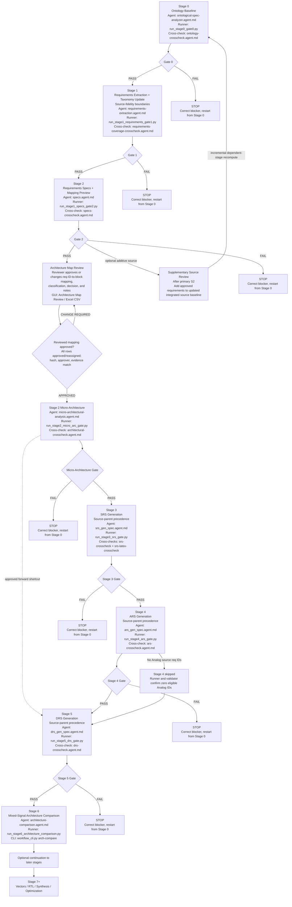
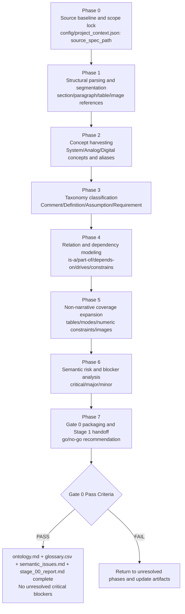

# Workflow Diagram

This document contains the standalone stage-gate workflow diagram.

Stage 0 is executed with a mandatory phased model (Phase 0 through Phase 7) before Gate 0 can pass.

Stage 0 ontology mission note:
- Ontology study formalizes concepts/properties/relationships using cross-source evidence from text, tables, figures/diagrams, captions/references, and evidence-bearing footnotes.
- Stage 0 uses a comparison-for-completion method: text extraction + table/image extraction + cross-source comparison + gap completion + conflict reporting.

Stage annotations include:
- `Agent`: responsible primary agent file.
- `Script`: primary executable script(s) used in the current flow.

Operational note:
- Full-flow stage runner scripts print a startup banner listing expected generated artifacts.

Source-read policy:
- Only Stage 1 reads the initial source specification file directly.
- Stage 2+ consumes Stage 1 and downstream artifacts only.
- `scripts/guard_stage2_plus_spec_independence.py` enforces this rule in Stage 2+ generation entrypoints.

Primary-source bootstrap policy:
- Once the primary source specification is selected and explicitly approved, its immutable source metadata and approved tagging result form the deterministic bootstrap context for applicable OCR, local RAG indexing/query preparation, vocabulary context, and taxonomy processing.
- Candidate vocabulary and taxonomy updates remain staged and approval-gated; they do not silently rewrite approved primary-source metadata.
- Supplementary sources are additive review inputs and never replace the approved primary bootstrap context.

Source-fidelity and routing policy:
- Tagged source requirements are extracted in source order through the configured tag terminator or the next tagged requirement ID; OCR-wrapped physical lines are joined with spaces and text from adjacent requirements is excluded.
- A requirement with an explicit source parent is retained under that local source paragraph before block mapping. Equivalent local labels for one requirement family may be normalized into one child paragraph beneath the parent, while source titles, wording, IDs, and Stage 2A ownership remain traceable. This rule applies consistently to SRS, ARS, and DRS generation.
- Reset/clock table rows, interaction-matrix edges, and dedicated lifecycle or configuration paragraphs retain their specialized routing precedence.
- Each source requirement ID is emitted once. SRS uses the source ID in `Covers:`; ARS and DRS use the corresponding authored SRS ID.

Stage 0 execution policy:
- `scripts/run_stage0_gate0.py` executes init, ontology output generation, Stage 0 report generation, ontology crosscheck, and gate validation.
- Gate 0 fails for placeholder/template ontology artifacts or missing ontology-study deliverables.

Specification-format note (Stage 3/4/5):
- SRS/ARS/DRS generated markdown includes `0. Document Navigation` (TOC, internal indexes, document control tables, table of tables).
- Project-specific sub-block requirement entries use plain field lines (`Inputs`, `Outputs`, `Requirement ID`, `Statement`, `Covers`) with one-to-one `Covers` mapping.
- General requirement catalogs are residual-only; mapped details remain only in project-specific sub-block requirement paragraphs.

DOCX-ready text-formatting policy:
- Preserve source requirement wording and order; normalize only OCR physical line wraps by joining continuation lines with spaces.
- Preserve source capitalization, punctuation, units, symbols, register names, signal names, and annotations; do not paraphrase, truncate, or merge text from adjacent requirements.
- Keep each authored requirement as one Markdown block with a blank line before its header and after `Covers:`. Terminate every requirement with a visible `[End]` paragraph after `Covers:` when present, or at the requirement boundary when no `Covers:` field exists. DOCX conversion verifies that every `[End]` marker remains visible in the generated Word document.
- Keep source bullets and numbered items as separate Markdown list items with standard `-` markers; do not insert blank lines between items in one list.
- Preserve numbered-list sequence and nesting. Use consistent four-space indentation for nested list items and continuation lines, and never use tabs for Markdown indentation.
- Keep continuation text indented beneath its owning list item or paragraph; do not promote wrapped continuation text to a new heading, list, or paragraph.
- Insert a blank line before each independent list or paragraph so Markdown and Pandoc preserve DOCX paragraph and list boundaries.
- Keep headings separated from surrounding paragraphs by blank lines and preserve their hierarchy; do not create headings from ordinary numbered requirement prose.
- Keep source IDs in the appropriate `Covers:` field only: source IDs for SRS and authored SRS IDs for ARS/DRS.
- Render source images and figures as actual image assets when available, preserving figure order, caption text, and source references; do not replace an image with a textual placeholder or invented description.
- Preserve image aspect ratio and use stable width constraints suitable for DOCX; keep captions directly below their images and separate captions from surrounding paragraphs with blank lines.
- When an image asset is unavailable, retain its exact caption and provenance as reference evidence and report the missing asset rather than fabricating visual content.
- Keep Mermaid diagrams inside fenced `mermaid` blocks; diagram labels use quoted labels with explicit ` ` breaks and HTML labels enabled, and are not converted into ordinary document paragraphs.

Stage 2A mapping order:
1. Build the concrete block inventory from the project profile and architecture evidence.
2. Resolve explicit source-section ownership and configured aliases.
3. Cascade the nearest meaningful source parent title through numbered child items and continuation pages.
4. Preserve tagged requirement text to the configured terminator or next requirement ID, joining wrapped OCR lines without crossing requirement boundaries.
5. Identify non-specific parent paragraphs; child items inherit source-function context when the parent has no configured block owner.
6. Map the remaining requirements to inventory items using explicit ownership, mapping rules, and supported block functions.
7. Group inherited requirements by parent title and write block traceability plus the non-block routing ledger.
8. SRS, ARS, and DRS consume those artifacts; explicit user-facing source-parent requirements remain in their local source paragraphs before block mapping.

Supplementary source review and refresh:
- Supplementary source review is an additive step after the primary source has completed Stage 2. It does not replace or precede the primary source flow.
- After the reviewer accepts supplementary requirements, they are added to the updated integrated source baseline. The workflow then performs an incremental refresh/recompute of dependent stages; this is not a destructive restart.
- The supplementary cycle invalidates the prior current versions of the canonical integrated corpus, architecture review mapping, approved mapping snapshot, hierarchical specifications, and SysML traceability outputs. Those artifacts are regenerated from the updated baseline through Stage 0, Stage 1, Stage 2, Architecture Map Review, and Stage 2A.
- Prior approvals, source-review workbooks, run manifests, and generated artifact history remain auditable. The refreshed architecture mapping and approval snapshot require a new review/hash approval because their inputs changed; prior approval records remain historical evidence and are never silently reused as current approval.

Derived artifact completeness and diagnostics:
- SRS/ARS/DRS XLSX files and SysML files are derived artifacts and must identify the approved snapshot and source fingerprint used to create them.
- SysML generation includes every approved requirement mapped to each represented block by default. A reduced output is allowed only with an explicit partial-export option and is recorded in the model manifest.
- `artifacts/validation/authority_consistency_scan.json` is a diagnostic report only. Its findings expose legacy, source-specific, mutable-artifact, and embedded-resource assumptions for review; they do not become workflow authority or block approved generation by themselves.
- The GUI is a non-authoritative display and action surface. Its full click/display behavior still requires a Windows display session; pure status formatting and action command construction remain unit-testable without Tk.

Architecture Map Review approval gate:
- After Stage 2, the reviewer opens `architecture_mapping_preview.csv` or `.md` through the GUI `Architecture Map Review` control.
- For each source requirement ID, the reviewer confirms or changes the candidate/approved block, approved classification, review decision, and optional reviewer notes.
- **Mandatory synchronization rule:** `architecture_mapping_preview.xlsx` is the editable review surface and `architecture_mapping_preview.csv` is the machine-readable handoff. Before Stage 2A approval, Stage 2A execution, or Stage 2B snapshot freezing, the saved and closed workbook must be synchronized into the CSV. The synchronization rejects duplicate, missing, unknown, unsaved, or mismatched rows and verifies every `approved_block` was persisted; a stale CSV must never be consumed.
- `approved` and `reassigned` are approval decisions. A reassigned row requires an approved block; `rejected` and `needs_clarification` block Stage 2A.
- The reviewer records the reviewed CSV hash, approver, and approval time in the architecture profile. Stage 2A runs only when this approval record matches the current reviewed mapping CSV and required evidence hashes.

CLI execution mode (deterministic, script-only):
- Primary entrypoint: `python scripts/workflow_cli.py`
- `taxonomy-update`: deterministic Stage 1 taxonomy refresh from OCR index
- `arch-compare`: Stage 6 mixed-signal architecture comparison against another workspace project
- `run`: strict forward pipeline; one stage or an ascending range from any stage, one attempt per stage, validation after each stage
- `drs-after-stage2a`: approved forward-only requirements path from Stage 2A to Stage 5
- `validate`: complete gate validation (`--all`)
- `status`: runner/validator map and lock state
- Range order is canonical and inclusive: `0 -> 1 -> 2 -> 2a -> 3 -> 4 -> 5`
- Stage `2a` is mandatory before Stage `3`
- Any runner or gate failure stops execution; corrections rerun the affected stage or an ascending range.
- Retries, loops, and backward transitions are prohibited; single-stage runs are allowed. Stage 4 is the sole conditional skip when its runner and validator both confirm zero Analog-category source requirement IDs.
- Stage 6 comparison runs as a standalone command after Stage 5

## Stage 0 Phases And Gate 0 Criteria

